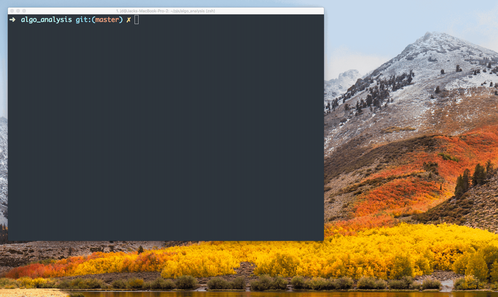

# Algo Analyser

Generate random lists and compare sorting times. Different algorithms are more efficient with different kinds of data. View sort results for one list or generate a chart for multiple lists.

Selecting 1 list will show output and timings. Selecting more than will will produce the gnuplot diagram. 

### Instructions

**Linux:**

make

**Mac:**

brew install gnuplot --with-qt

clang main.c sort.c tools.c output.c -o main

---

*Run with:*

./main